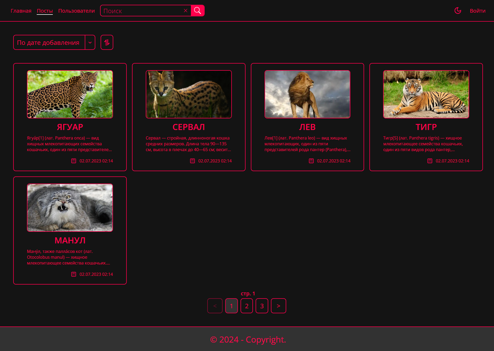
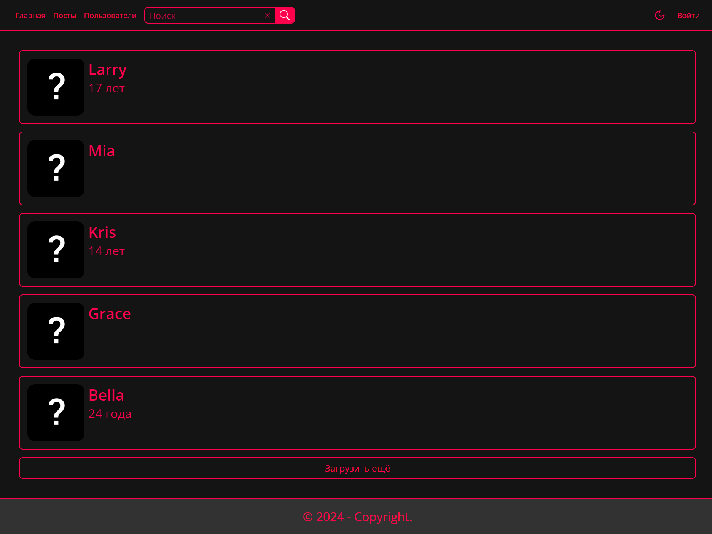
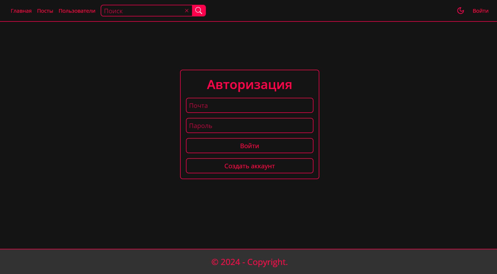
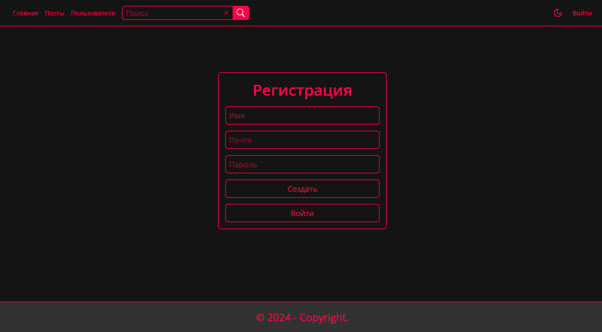
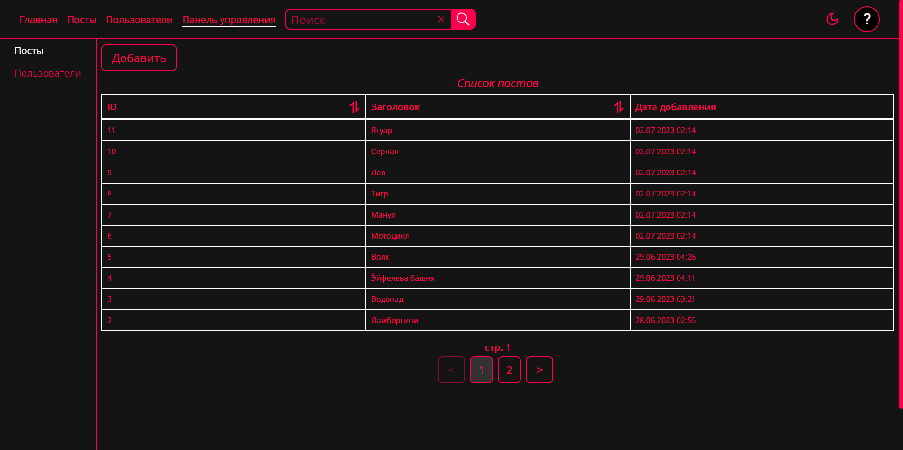
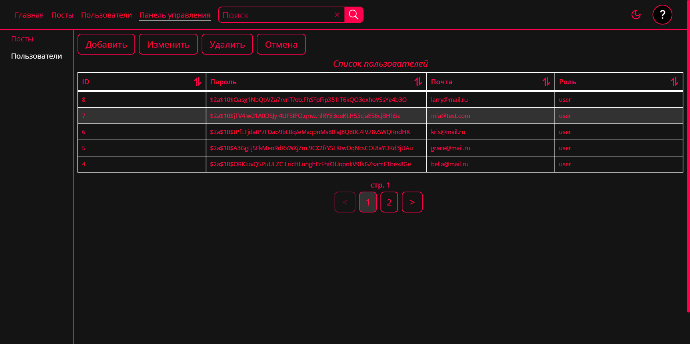
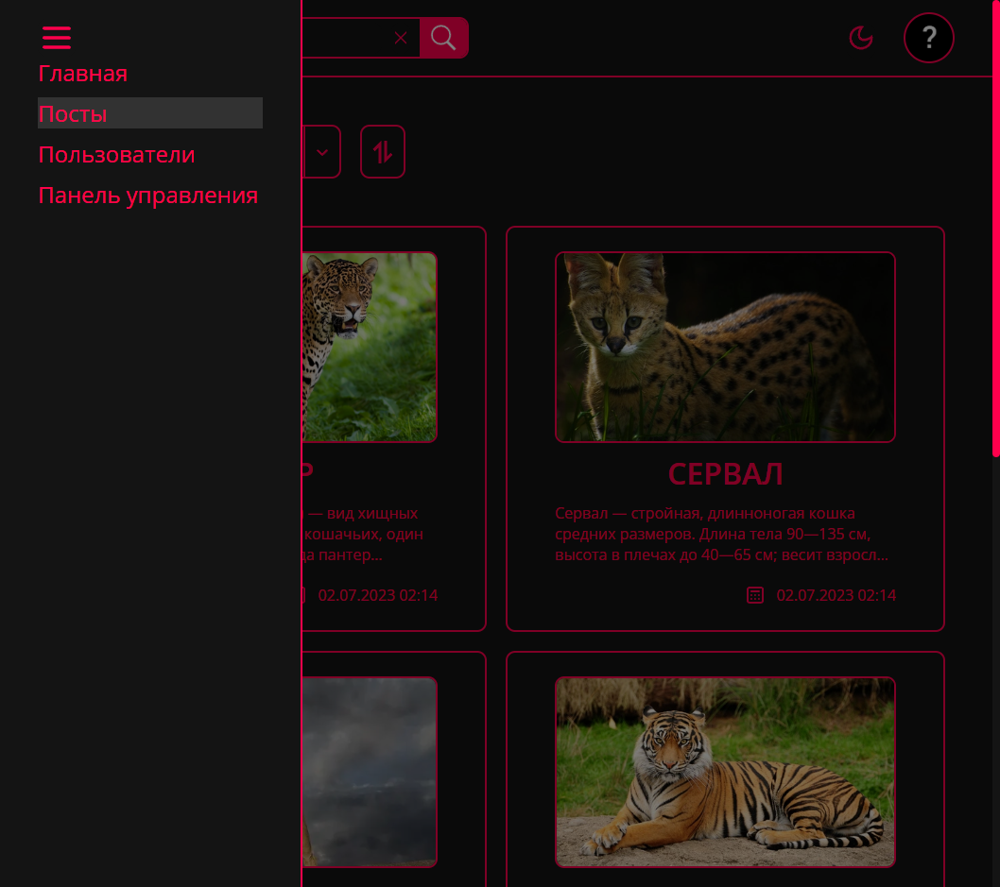

# Auth

### **Start app**

1. _Fork or download the app and open the folder in the cli_
2. _Install all dependencies using the `yarn` command_
3. _Build the project using the `yarn build` command_
4. _Start the web server using the `yarn preview` command. The app will be served at http://localhost:4173/._

### **Start JSON-server**

1. _Start server using the `yarn db` command_

---

 <details><summary><b>Screenshots</b></summary>    
  
<h3>Main</h3><hr>
<h3>Posts</h3><hr>
<h3>Post</h3><hr>
<h3>Users</h3><hr>
<h3>User</h3><hr>
<h3>Search</h3><hr>
<h3>Login</h3><hr>
<h3>Registration</h3><hr>
<h3>Profile</h3><hr>
<h3>Settings</h3><hr>
<h3>Dashboard Posts</h3><hr>
<h3>Add Post</h3><hr>
<h3>Edit Post</h3><hr>
<h3>Delete Post</h3><hr>
<h3>Dashboard Users</h3><hr>
<h3>Add User</h3><hr>
<h3>Update User Role</h3><hr>
<h3>Delete User</h3><hr>
<h3>Light Theme</h3><hr>
<h3>Adaptive</h3>
</details>

---

<details><summary><b>Routes</b></summary>

-  **Public routes**

   -  _/posts_
   -  _/posts/:id_
   -  _/users_
   -  _/user/:id_
   -  _/search_
   -  _/login_
   -  _/registration_

-  **Private routes**
   -  _/profile_
   -  _/profile/settings_
-  **Admin routes**
   -  _/dashboard/posts_
   -  _/dashboard/users_
   </details>

---

### **Admin login data**

```
Email - admin@mail.ru
Password - admin
```

### **Technology stack:**

-  _Vite_
-  _React_
-  _Typescript_
-  _SCSS_
-  _MobX_
-  _Axios_
-  _React-router-dom_
-  _React-query_
-  _React-hook-form_
-  _React-select_
-  _React-hot-toast_
-  _Json-server-auth_
